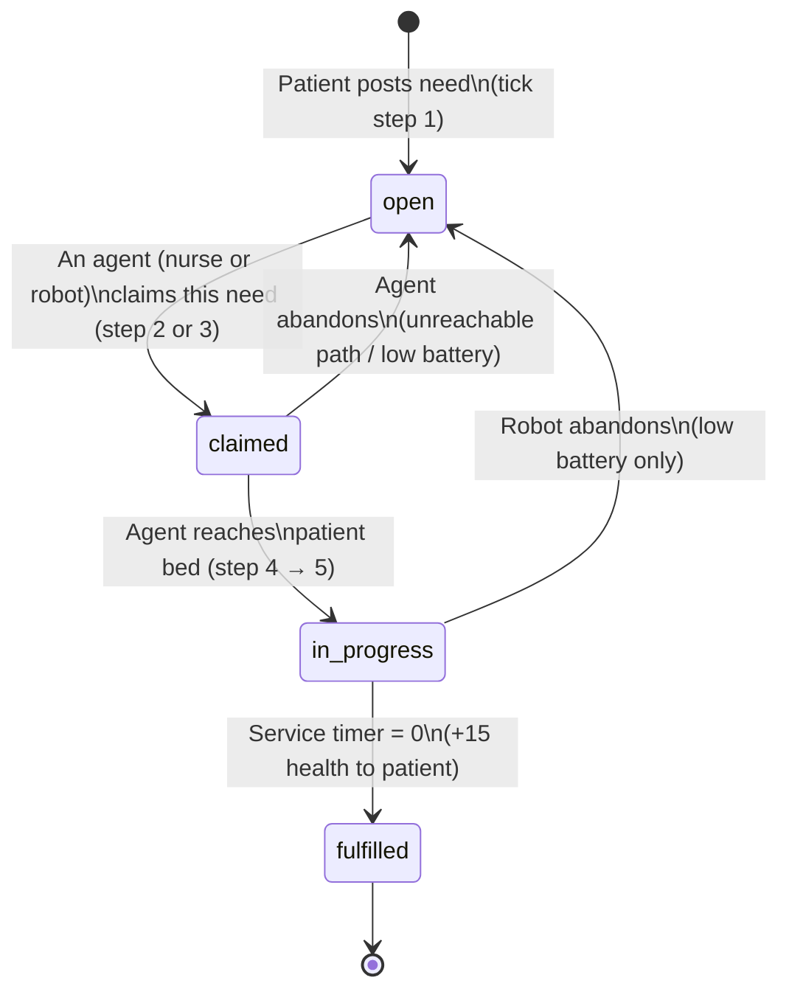
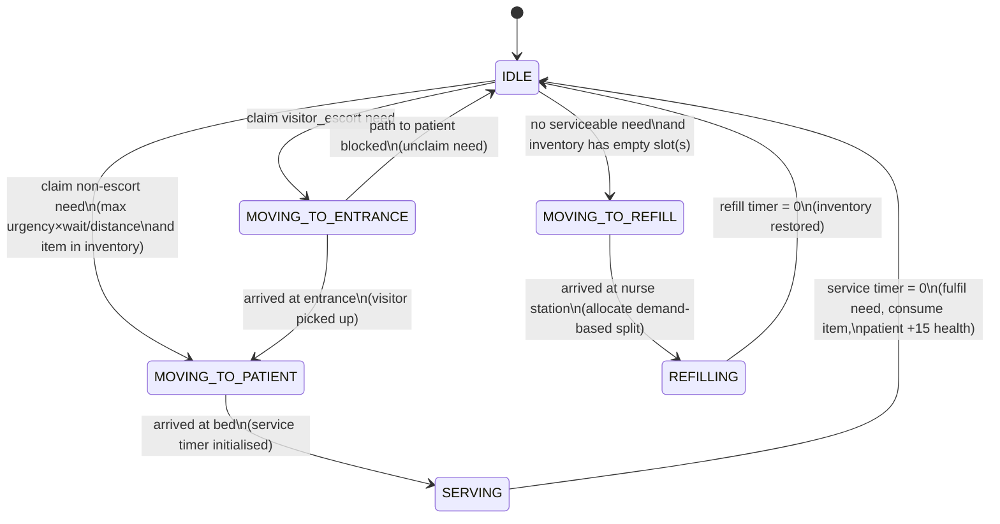
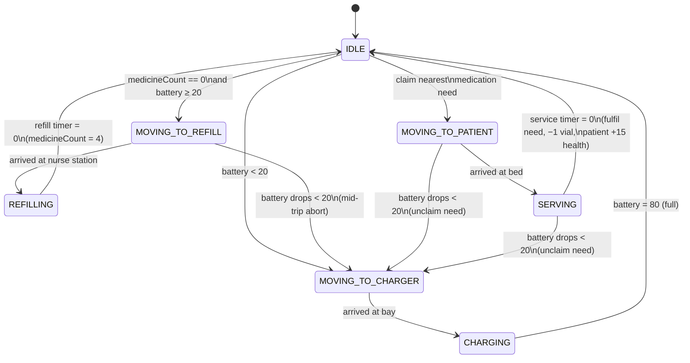
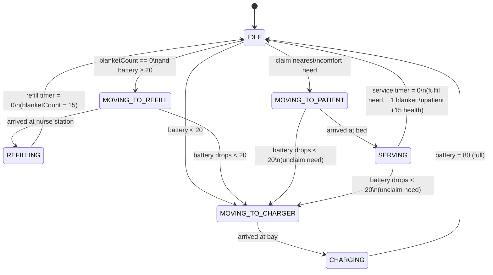
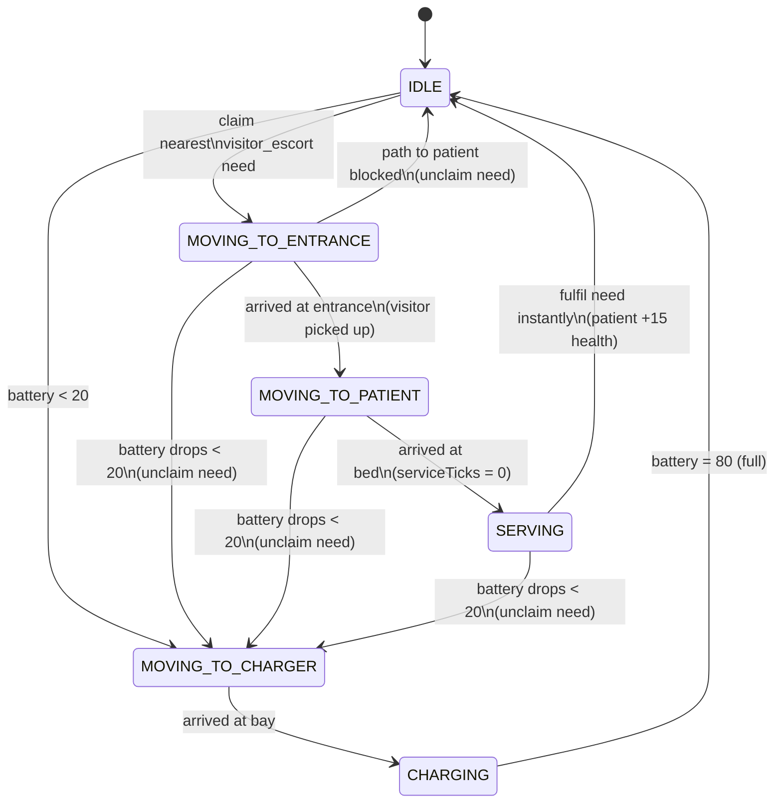

# CGH Hospital Robot Agent-Based Model — Model Documentation

**Course:** 40.015 Simulation Modelling and Analysis
**Project:** Feasibility study of service robots in the Emergency Department at Changi General Hospital (CGH), Singapore
**Document type:** Self-contained model description (structure, rules, assumptions, state diagrams)
**Related documents:** `docs/SIMULATION_SPEC.md` (implementation-level spec), `experiments/report/OUTPUT_ANALYSIS.md` (results and statistical analysis)

---

## Table of Contents

1. [Abstract](#1-abstract)
2. [Background and Motivation](#2-background-and-motivation)
3. [Modelling Approach](#3-modelling-approach)
4. [Spatial Model](#4-spatial-model)
5. [Temporal Model and Tick Execution Order](#5-temporal-model-and-tick-execution-order)
6. [Agent Specifications](#6-agent-specifications)
   - 6.1 [Patient](#61-patient)
   - 6.2 [Nurse](#62-nurse)
   - 6.3 [RobotMEDi (Medication Transport)](#63-robotmedi-medication-transport)
   - 6.4 [RobotBLANKi (Comfort Items)](#64-robotblanki-comfort-items)
   - 6.5 [RobotEDi (Visitor Escort)](#65-robotedi-visitor-escort)
7. [Shared Infrastructure](#7-shared-infrastructure)
8. [Scenarios Compared](#8-scenarios-compared)
9. [Key Performance Indicators](#9-key-performance-indicators)
10. [Assumptions and Simplifications](#10-assumptions-and-simplifications)
11. [Determinism and Reproducibility](#11-determinism-and-reproducibility)
12. [Parameter Reference](#12-parameter-reference)
13. [Glossary](#13-glossary)

---

## 1. Abstract

This report documents an Agent-Based Model (ABM) of a 48-bed inpatient ward modelled on the Emergency Department at Changi General Hospital (CGH). The model simulates a single 8-hour nursing shift in which patients stochastically generate four classes of care need — **emergency**, **medication**, **comfort**, and **visitor escort** — and a staff of nurses (and optionally service robots) competes to fulfil them before patients' health deteriorates. Two scenarios are compared under common random numbers:

- **Scenario A — Nurses Only:** nurses handle every need type.
- **Scenario B — Nurses + Robots:** the same nurse complement is augmented with three service-robot classes (MEDi for medication delivery, BLANKi for comfort items, EDi for visitor escort).

The research question is whether deploying robots measurably reduces patient wait time and the incidence of critical health events, by offloading non-clinical work from nurses and freeing them to respond to emergencies. The core modelling asymmetry is that **only nurses can handle emergencies** — robots are never eligible to claim emergency needs. This makes the robots' contribution entirely indirect: they create capacity for nurses.

---

## 2. Background and Motivation

In July 2023, Changi General Hospital piloted three service robots in the ED ward:

| Robot | Real-world role | Model analogue |
|-------|-----------------|----------------|
| **MEDi** | Medication trolley / delivery | `RobotMEDi` |
| **BLANKi** | Blanket and comfort-item dispenser | `RobotBLANKi` |
| **EDi** | Visitor / family escort | `RobotEDi` |

The operational hypothesis behind the deployment is that a large fraction of a nurse's time is spent on *non-clinical* errands — fetching blankets, delivering medication, escorting visitors — and that transferring these errands to robots could free nurse capacity for time-critical clinical work. This ABM formalises that hypothesis in executable form: patients, nurses and robots all act as autonomous agents competing for the same global queue of unmet needs, and their emergent behaviour determines ward-level outcomes.

The model is deliberately bounded:

- **Single 8-hour shift, single ward.** No shift handovers, no ward transfers, no diurnal variation in arrivals.
- **Effectiveness only, not cost.** The model compares patient outcomes and staff utilisation between the two scenarios; it does not model capital or operating cost.
- **Workflow level, not clinical level.** Service times are coarse-grained aggregates; the model does not represent specific drugs, vital signs, triage levels, or medical procedures.

---

## 3. Modelling Approach

### 3.1 Why an Agent-Based Model?

Closed-form queueing results (e.g. M/M/c) would struggle with three features of the real ward:

1. **Heterogeneous servers.** Nurses, MEDi, BLANKi and EDi have different service rates, different eligible need types, and different mobility / battery constraints.
2. **Spatial contention.** Travel time between beds and the nurse station is a meaningful fraction of service time, so the spatial layout matters.
3. **Local decision rules.** Each agent picks the next task greedily from a shared queue using its own scoring or nearest-first rule; this produces the coordination dynamics we want to observe.

An agent-based formulation keeps the rules local and legible (each agent "reads" only the need queue and the grid), while the aggregate KPIs emerge from the interactions.

### 3.2 Discrete-time, tick-driven scheduler

Time advances in discrete ticks of fixed duration (30 seconds of ward time per tick). A full simulation run is **960 ticks = 8 h**, with the first **50 ticks treated as warm-up** and excluded from KPI aggregation. At each tick every agent is given an opportunity to act, in a **strict eight-step order** described in §5. There is no continuous-time event scheduler — this is a synchronous cellular-automaton-style model on top of a grid.

### 3.3 Seeded PRNG and reproducibility

All stochastic decisions (need generation, service-time sampling) route through a **seeded linear-congruential PRNG** (`SeededRandom`). `Math.random()` is never called directly anywhere in the simulation code. Given the same seed and the same configuration, two runs produce bitwise-identical KPI output. This is what makes paired t-tests across Scenarios A and B sound: the same seed drives the same patient-need sequence in both scenarios, so differences in KPIs are driven solely by the presence or absence of robots.

### 3.4 Headless-capable architecture

The code is split so that `src/simulation/*` has no dependency on the DOM or on Pixi.js. The `Scheduler` can be instantiated and stepped without a browser — which is what the experiment harness in `experiments/run_sweep.mjs` does when running thousands of replications in batch.

---

## 4. Spatial Model

### 4.1 Grid

The ward is a **20 × 15 rectangular grid** (`CONFIG.GRID_WIDTH`, `CONFIG.GRID_HEIGHT`). Each cell has exactly one type:

| Symbol | Type | Walkable? | Role |
|--------|------|:---------:|------|
| `.` | CORRIDOR | ✅ | free travel |
| `B` | BED | ❌ (target-only) | patient location; agents approach via an adjacent corridor cell |
| `N` | NURSE_STATION | ✅ | refill location (both nurse and MEDi/BLANKi restock here) |
| `C` | CHARGING_BAY | ✅ | robot charging point |
| `E` | ENTRANCE | ✅ | visitor pickup point for visitor-escort needs |
| `#` | WALL | ❌ | blocks movement |

The default layout has **48 beds** arranged in four horizontal bays (four rows × twelve beds each, separated by central corridor and internal walls), **4 nurse stations**, **3 charging bays** lined along the right wall, and **1 entrance** on the left wall. Patients are spawned one per bed at initialisation, so the ward carries 48 patients throughout the shift.

### 4.2 Pathfinding

Paths are computed with **breadth-first search (BFS)** on the grid (`Grid.findPath`). BFS guarantees the shortest rectilinear path, is cheap at this grid size, and produces deterministic ties (the neighbour order is fixed). Beds are special-cased: because beds are non-walkable, an agent targeting a bed actually navigates to the first walkable neighbour of that bed (search order: N, S, W, E).

Scoring and "nearest need" decisions use **Manhattan distance**, not actual BFS path length. This is a deliberate simplification — Manhattan is a lower bound on BFS length and captures the relative ordering well enough for greedy selection, at a fraction of the cost.

### 4.3 Agent occupancy

Multiple agents may share the same cell. There is no collision, queueing or "blocking" — in reality a nurse and a robot can stand next to a bed simultaneously, and the model abstracts the physical-proximity detail away. This is documented as assumption **A-2** in §10.

---

## 5. Temporal Model and Tick Execution Order

One tick is **30 seconds of ward time** (`REAL_SECONDS_PER_TICK`). One run is **960 ticks** (`TICKS_PER_RUN`) — an eight-hour nursing shift. In the browser, each tick is rendered over 200 ms by default (controlled by a Speed slider for visual playback); headless batch runs dispatch ticks as fast as the engine can compute them.

### 5.1 The 8-step tick (strict order)

Every tick, the `Scheduler` executes the following eight steps **exactly in this order**. The order is load-bearing: changing it introduces race conditions in claim/fulfil semantics.

| Step | Who acts | What happens |
|:----:|----------|-------------|
| **1** | Patients | For each patient, for each of the 4 need types with no currently active need of that type, sample a Bernoulli variable against `NEED_SPAWN_RATE[type]`. On success, post a new need to the NeedQueue. |
| **2** | Robots | Each robot, if `IDLE` and above battery threshold, inspects the queue for open needs it can serve and either claims one (nearest by Manhattan distance), goes to refill, or goes to charge. |
| **3** | Nurses | Each nurse, if `IDLE`, scores every *serviceable* open need (one whose required item the nurse carries) by `urgency_weight × wait_ticks / distance` and claims the highest-scoring one. If no serviceable need exists and the nurse has empty inventory slots, the nurse goes to refill. |
| **4** | All mobile agents | Nurses and robots advance one path step. Nurses move at 1 tick/cell; robots at 2 ticks/cell — robots are explicitly slower than humans. |
| **5** | All active agents | Service and refill timers are decremented. (Battery is updated in step 6.) |
| **6** | All active agents | Task-completion transitions fire: completed services fulfil the need, consume one carried item (for medication/comfort), and grant the patient `HEALTH_RECOVERY_PER_NEED` health. Completed refills restore inventory. Robots also update battery here (drain or charge depending on state) and pre-empt the current task to go charge if battery has dropped below threshold. |
| **7** | Patients | Every patient with one or more still-active (unfulfilled) needs loses health at `HEALTH_DRAIN_PER_TICK[type]` per active need. If health reaches 0, a **critical incident** is logged and health is reset to `HEALTH_CRITICAL_RESET`. |
| **8** | Stats | Snapshot this tick: active-need count, nurse utilisation, robot utilisation, mean patient health, lowest patient health. |

### 5.2 Why this order matters

Three orderings are worth calling out:

- **Robots decide before nurses (step 2 before 3).** If nurses decided first they would pre-empt the cheap routine needs with their high-weight emergency-aware scoring, leaving robots idle. Letting robots claim first respects the deployment intent: robots should grab routine tasks so nurses don't have to.
- **Fulfil before drain (step 6 before 7).** A need fulfilled this tick should not continue to drain health this tick — otherwise the patient is penalised for a need that is, as of this tick, already resolved.
- **Stats last (step 8).** The snapshot captures post-transition state so KPI plots are consistent with the rest of the tick.

---

## 6. Agent Specifications

### 6.1 Patient

#### Role

Stationary, occupies a bed, generates needs, and accumulates / loses health. Patients are the *source* of all work in the model; they never move or make decisions about which agent helps them.

#### State

Patients have a single declared state `IN_BED` — there is no meaningful patient-body state machine, because patients do not move or change role. The interesting dynamics for a patient are the lifecycle of the **needs** they generate. The diagram below shows the **need lifecycle** (one instance per generated need).

#### Rules

- **Health:** starts at `HEALTH_MAX = 100`. Bounded to [0, 100].
- **Need generation (tick step 1):** for each of the four need types, if the patient has no currently active need of that type, draw `U ~ Uniform(0, 1)` and post a new need if `U < NEED_SPAWN_RATE[type]`. The four types are sampled independently each tick, so a patient can generate more than one need per tick.
- **Invariant:** a patient cannot hold two active needs of the same type simultaneously (e.g. no two open medication needs).
- **Health drain (tick step 7):** `health -= Σ_over_active_needs HEALTH_DRAIN_PER_TICK[need.type]`. This is linear and additive: a patient with open emergency + medication + comfort simultaneously loses `1.0 + 0.3 + 0.1 = 1.4` health per tick.
- **Recovery (tick step 6):** on fulfilment of a need, the patient gains `HEALTH_RECOVERY_PER_NEED = 15`, clamped at `HEALTH_MAX`. The recovery is flat — it does not scale with need severity.
- **Critical incident:** if health reaches ≤ 0 during step 7, it is reset to `HEALTH_CRITICAL_RESET = 25`, and the patient's critical-incident counter is incremented. The patient remains in the ward. Critical incidents are logged to `Stats` and summed across the replication as one of the headline KPIs.

#### Need lifecycle state diagram



### 6.2 Nurse

#### Role

General-purpose caregiver. Only agent that can handle **emergency** needs. Also the only agent that can *choose* among need types — nurses are generalists, whereas each robot class is specialised.

#### States

```
IDLE, MOVING_TO_ENTRANCE, MOVING_TO_REFILL, REFILLING, MOVING_TO_PATIENT, SERVING
```

#### Inventory

A nurse carries up to `NURSE_ITEM_CAPACITY = 2` items total, split dynamically between medicine vials and blankets. Nurses start the shift with 1 vial + 1 blanket. One medication need consumes one vial; one comfort need consumes one blanket. Emergency and visitor-escort needs consume no inventory.

**Demand-based allocation:** when a nurse arrives at a nurse station to refill, it inspects the current queue of open needs and splits its empty slots proportional to the number of open medication vs. comfort needs, clamped so that both types get at least one slot when both types have demand. If only one type has demand, all slots go to that type. If neither has demand, the split is even (medicine gets the remainder on odd capacity). The snapshot is taken at arrival; demand that appears during refilling does not retroactively re-allocate the inventory.

#### Decision rule

When `IDLE` (tick step 3):

1. Iterate the list of open needs in the queue.
2. Skip any need for which the nurse lacks the required item (medication if `medicineCount == 0`, comfort if `blanketCount == 0`).
3. For each candidate, compute

   ```
   score = urgency_weight × max(1, current_tick − created_at_tick) / max(1, manhattan_distance)
   ```

   where `urgency_weight` is 10 (emergency), 5 (medication), 2 (comfort), 1 (visitor escort).

4. Claim the candidate with the highest score. On tie, the first-seen wins (queue order).
5. For a visitor-escort claim, set destination to the nearest entrance first; otherwise set destination to the patient's bed directly.
6. If no serviceable candidate exists and there are empty inventory slots, navigate to the nearest nurse station to refill.

The scoring rule balances three competing considerations: **urgency** (emergencies dominate), **fairness** (wait time so older needs aren't starved), and **efficiency** (closer needs are preferred all else equal).

#### Service times (ticks, uniform integer on `[min, max]`)

| Need | Range |
|------|-------|
| emergency | [20, 40] |
| medication | [6, 10] |
| comfort | [1, 3] |
| visitor_escort | [3, 6] |

#### Refill time (ticks)

`med_slots_to_fill × 4  +  blanket_slots_to_fill × 1` (minimum 1 tick). Medicine is slower to stock (e.g. drug reconciliation) than blankets.

#### Movement

1 tick per cell (`MOVEMENT_TICKS_PER_CELL.nurse = 1`).

#### State diagram



### 6.3 RobotMEDi (Medication Transport)

#### Role

Autonomous medication-delivery robot. Serves **medication needs only**. Cannot respond to emergencies, comfort needs, or visitor-escort needs.

#### States

```
IDLE, MOVING_TO_PATIENT, SERVING, MOVING_TO_REFILL, REFILLING, MOVING_TO_CHARGER, CHARGING
```

#### Inventory, battery, movement

| Property | Value |
|----------|-------|
| Capacity | `MEDI_ITEM_CAPACITY = 4` vials |
| Refill time | `4 × REFILL_TIME_PER_MEDICINE = 16` ticks (restores full inventory in one go) |
| Battery max | `BATTERY_MAX = 80` |
| Battery drain (moving) | 0.25/tick |
| Battery drain (serving, refilling) | 0.1/tick |
| Battery drain (idle) | 0.1/tick |
| Battery charge rate | +0.5/tick |
| Low-battery threshold | 20 |
| Movement | 2 ticks/cell (half nurse speed) |
| Service time (medication) | Uniform integer on [14, 18] ticks |

#### Decision rule

When `IDLE` (tick step 2):

1. If `battery < BATTERY_LOW_THRESHOLD`, navigate to nearest charging bay → `MOVING_TO_CHARGER`. Charging has priority over everything else.
2. Else if inventory is empty (`medicineCount == 0`), navigate to nearest nurse station → `MOVING_TO_REFILL`.
3. Else select the **nearest** open medication need by Manhattan distance (no urgency or wait weighting), claim it, navigate to the patient → `MOVING_TO_PATIENT`.
4. If no medication need is open, stay `IDLE` (do not speculatively charge or refill).

The "nearest-first" rule (rather than the urgency-weighted rule used by nurses) is a deliberate design choice: robots are meant to process routine medication throughput, and favouring proximity minimises unnecessary battery expenditure and travel.

#### Low-battery pre-emption

If at any point during `MOVING_TO_REFILL`, `REFILLING`, `MOVING_TO_PATIENT` or `SERVING` the battery falls below the threshold, the robot **abandons** the current task: it unclaims the need (if it had one) and transitions to `MOVING_TO_CHARGER`. This is the only form of task interruption in the entire model.

#### State diagram



### 6.4 RobotBLANKi (Comfort Items)

#### Role

Autonomous blanket / comfort-item dispenser. Serves **comfort needs only**. Structurally identical to MEDi, differing only in the item it carries, capacity, service time, and eligible need type.

#### Key differences from MEDi

| Property | MEDi | BLANKi |
|----------|------|--------|
| Eligible need | medication | comfort |
| Inventory item | medicine vials | blankets |
| Capacity | 4 | 15 |
| Refill time | 16 ticks | 15 ticks (`15 × 1`) |
| Service time | [14, 18] | [5, 6] |

BLANKi's larger inventory and shorter service time reflect the real-world reality that blankets are bulk-stocked items that are handed over quickly, whereas medications are delivered one dose at a time and handover requires a short verification dialogue.

Battery mechanics, movement speed, decision rule (nearest-first), and low-battery pre-emption are identical to MEDi.

#### State diagram



### 6.5 RobotEDi (Visitor Escort)

#### Role

Autonomous visitor-escort robot. Serves **visitor-escort needs only**. Has no inventory — its "service" is walking-presence, not delivery.

#### States

```
IDLE, MOVING_TO_ENTRANCE, MOVING_TO_PATIENT, SERVING, MOVING_TO_CHARGER, CHARGING
```

(Note: no `MOVING_TO_REFILL` or `REFILLING` — nothing to refill.)

#### Decision rule

When `IDLE` (tick step 2):

1. If `battery < 20`, navigate to nearest charging bay.
2. Else select the nearest open visitor-escort need by Manhattan distance, claim it, and navigate **first to the nearest entrance** (to "pick up" the visitor) → `MOVING_TO_ENTRANCE`.
3. On arrival at the entrance, re-target to the patient's bed → `MOVING_TO_PATIENT`.
4. On arrival at the bed, enter `SERVING`. Service time is **0 ticks** (an implementation detail: `serviceTicksRemaining` is set to 0 in `_beginServing`, so the need is fulfilled at the next step-6 transition regardless of the `[6, 10]` range listed in `config.SERVICE_TIME.robot.visitor_escort`, which is currently unused by EDi). The visitor is considered handed off immediately on arrival; all perceived "escort time" in the KPI is travel time.

#### State diagram



---

## 7. Shared Infrastructure

### 7.1 NeedQueue — global coordination, not a dispatcher

The `NeedQueue` is a **global passive registry** of all unfulfilled needs. Crucially, it is *not* a dispatcher: it does not assign needs to agents. Agents poll the queue independently and compete to claim needs. This is central to the emergent behaviour of the model — the only synchronisation is:

- Per-need atomicity at claim time: if two agents attempt to claim the same need in the same tick, one of them succeeds and the other gets no need this tick (its score-computation loop is re-entered next tick).
- Step ordering in §5.1: robots always decide before nurses.

#### Need object schema

Each need carries `id, type, patientId, position, urgencyWeight, createdAtTick, claimedBy, status`. `status ∈ {open, claimed, in_progress, fulfilled}`.

#### Transitions

| Transition | Triggered by | Effect |
|------------|--------------|--------|
| `— → open` | Patient posts need | Added to queue |
| `open → claimed` | Agent claim in step 2 or 3 | `claimedBy = agent.id` |
| `claimed → in_progress` | Agent arrives at bed & starts service | `inProgressAtTick` recorded |
| `in_progress → fulfilled` | Service timer reaches 0 | Patient gains health |
| `claimed → open` | Agent unclaims | Re-opens for other agents |
| `in_progress → open` | Robot abandons for low battery | Re-opens |

Unclaiming is used in three circumstances: nurses/robots finding their path newly unreachable, and robots with dropping battery. After an unclaim the need returns to the competitive pool with its original `createdAtTick` preserved, so its wait time continues to accumulate.

### 7.2 Grid — cells and pathfinding

The `Grid` class wraps the 2D character array and exposes:

- `cellType(x, y)` — lookup
- `isWalkable(x, y)` — membership in `{., N, C, E}`
- `manhattanDistance(a, b)` — `|ax − bx| + |ay − by|`, used by scoring and nearest-need selection
- `findPath(from, to)` — BFS shortest path; returns an array of cells or `null`
- `getBeds()`, `getNurseStations()`, `getChargingBays()`, `getEntrances()` — typed cell enumerations, used at agent initialisation

### 7.3 Stats — KPI collection

`Stats` accumulates two kinds of data:

- **Per-tick snapshots** (written at step 8 each tick) for live charting: active need count, nurse utilisation, robot utilisation, mean patient health, lowest patient health.
- **Per-replication aggregates** (post-warm-up) for experimental comparisons: mean wait time by need type, critical-incident count, mean emergency-response time, mean nurse utilisation, mean robot utilisation, total needs generated and fulfilled, needs unfulfilled at end.

The warm-up window is the first `WARM_UP_TICKS = 50` ticks. All aggregate KPIs exclude this window to let the queue and agent positions reach a reasonable starting state (agents begin either at a nurse station, the first charging bay or the entrance, not at steady-state locations).

---

## 8. Scenarios Compared

The model supports two scenarios that share every parameter except the robot complement:

| | Scenario A (Nurses Only) | Scenario B (Nurses + Robots) |
|---|---|---|
| Nurses | `NURSE_COUNT` | `NURSE_COUNT` |
| MEDi | 0 | `MEDI_COUNT` |
| BLANKi | 0 | `BLANKI_COUNT` |
| EDi | 0 | `EDI_COUNT` |
| All other parameters | identical | identical |

The default configuration is `NURSE_COUNT = 4`, `MEDI_COUNT = BLANKI_COUNT = EDI_COUNT = 2`. The ward has 48 beds and thus 48 patients in both scenarios.

Because the PRNG seed drives patient-need generation deterministically, Scenarios A and B under the same seed experience **the same sequence of patient need events**. This is a textbook Common Random Numbers (CRN) variance-reduction setup: paired differences in KPIs across matched seeds isolate the robot effect from seed noise.

---

## 9. Key Performance Indicators

Five headline KPIs are reported per replication (all post-warm-up):

| KPI | Definition | Units |
|-----|------------|-------|
| **Mean wait time by need type** | Mean over all needs of (`inProgressAtTick − createdAtTick`) for each of emergency, medication, comfort, visitor_escort | ticks |
| **Critical incident count** | Number of times any patient's health hit 0 in the shift | count |
| **Mean emergency response time** | Mean of `inProgressAtTick − createdAtTick` restricted to emergency needs | ticks |
| **Mean nurse utilisation** | Mean over ticks of (`#nurses not in IDLE` / `#nurses`) | fraction ∈ [0, 1] |
| **Mean robot utilisation** | Mean over ticks of (`#robots not in IDLE and not CHARGING` / `#robots`); undefined in Scenario A | fraction ∈ [0, 1] |

Additional secondary series (per-tick) include active-need count by type, mean and lowest patient health, and instantaneous utilisation. These drive the live charts in the UI.

This document deliberately does **not** report experimental results. Those live in `experiments/report/OUTPUT_ANALYSIS.md`, which covers the factorial sweep, sensitivity analysis, Welch's t-test, and the deployment-heuristic conclusions.

---

## 10. Assumptions and Simplifications

The following assumptions are baked into the model; each is a conscious simplification that trades realism for analytical tractability. They are the primary threats to external validity and should be treated as such when interpreting results.

**A-1 Manhattan distance for decision-making.** All scoring and nearest-need selection uses Manhattan distance, not BFS path length. Walls and internal corridors can make the true travel cost materially larger than Manhattan in a few spots, so decisions are locally slightly sub-optimal. Actual agent travel, however, uses true BFS paths.

**A-2 No agent collision or queueing in corridors.** Any number of agents can share a cell. In reality, a narrow corridor or a bed with two caregivers at once would slow people down. The model ignores this; mean travel times are therefore a lower bound on real-world travel.

**A-3 Linear battery drain, constant charge rate.** No battery curve, no capacity fade, no charge-tapering behaviour. Battery life is deterministic given state history.

**A-4 Greedy local decisions, no coordination.** Each agent picks its next task myopically. There is no central planner, no explicit communication, and no look-ahead. A globally-optimal dispatch would in principle do better on the same need sequence; the "cost" of emergent coordination is part of what the model measures.

**A-5 No task interruption except for robot low-battery.** Once a nurse starts `SERVING`, she does not abandon the patient mid-task even if a higher-weight emergency appears elsewhere. In the real ward, nurses can and do break off lower-priority tasks. This is a known pessimistic bias against the Nurses-Only scenario (their emergency-response time would improve with pre-emption).

**A-6 Instant item consumption.** Medicine and blankets are consumed atomically on service completion; there is no partial-dose or partial-handover state.

**A-7 Refill allocation is a single snapshot at arrival.** Nurses decide their medicine/blanket split from queue demand **at the moment they arrive at the station**. New needs that appear during the refill do not re-allocate inventory. This can produce inventory-demand mismatches when the queue turns over rapidly.

**A-8 Visitor-escort is a need, not a separate visitor agent.** The model does not simulate the visitor as an entity that walks in, waits at the entrance, etc. The need is abstractly "fulfilled" when a nurse or EDi arrives at the patient's bed (having first stopped at the entrance, which represents the pickup). No visitor identity, no visitor congestion.

**A-9 EDi instant hand-off (0 service ticks).** The escort "service" is purely travel; the actual transfer takes 0 ticks. This biases EDi's measured service time downward but matches the pilot-deployment experience where EDi leaves the visitor at the bed and returns to base immediately.

**A-10 Single ward, single shift, no diurnal variation.** Need spawn rates are constant across the 960-tick run. Real-world arrival intensity varies by hour and by day of the week.

**A-11 Warm-up of 50 ticks may be short.** The project's separate output-analysis work (Welch's graphical method on a 30-replication sample) suggests the warm-up transient extends closer to 400 ticks for patient health. KPIs that depend on health may therefore carry some initial-condition bias.

**A-12 Identical capability within an agent class.** All nurses are interchangeable; all MEDi robots are interchangeable; etc. No skill heterogeneity, no fatigue, no learning.

**A-13 Synthetic parameters.** Spawn rates, service times, and urgency weights are chosen for plausibility and pedagogical legibility, not fitted to empirical CGH operational data. The model's *structure* is validated; its *absolute numerical outputs* are not to be taken as CGH forecasts.

**A-14 Flat health-recovery (+15).** Fulfilment of any need type grants the same health bonus, even though in reality addressing an emergency restores more relative well-being than delivering a blanket.

---

## 11. Determinism and Reproducibility

The simulation is fully deterministic given `(seed, config)`:

- A single seeded LCG (`SeededRandom`) services every random draw in the tick.
- The 8-step tick order is identical every tick, with no concurrency.
- Agent lists are iterated in their construction order, which is deterministic for a given `NURSE_COUNT` / `MEDI_COUNT` / ...
- `Math.random()` is never invoked from simulation code.

This determinism enables:

- **Paired analysis across scenarios.** Seeds 1..30 are reused between Scenario A and Scenario B; paired differences remove seed variance.
- **Bug detection.** Any non-determinism in KPIs at fixed seed indicates an implementation regression (e.g. a stray `Math.random()` or iteration-order bug).
- **Independent replication.** Given the seed range and the committed config, a third party can reproduce exactly the same KPI tables the project reports.

The default experimental design runs **30 replications per cell**, seeds 1..30. 30 is the pragmatic statistical minimum for the Central Limit Theorem to be useful on mean-based KPIs; for zero-inflated KPIs such as critical-incident counts under well-staffed conditions, more replications would be needed for tight confidence intervals.

---

## 12. Parameter Reference

The complete set of tunable parameters from `src/config.js`. All simulation code reads these via `config.*`; nothing is hard-coded outside this file.

### Grid and timing

| Key | Default | Role |
|-----|:-------:|------|
| `GRID_WIDTH` | 20 | Ward width in cells |
| `GRID_HEIGHT` | 15 | Ward height in cells |
| `TICK_DURATION_MS` | 200 | Render-loop tick period (UI only) |
| `TICKS_PER_RUN` | 960 | One shift = 8 h × 3600 s / 30 s |
| `WARM_UP_TICKS` | 50 | Excluded from KPI aggregation |
| `REAL_SECONDS_PER_TICK` | 30 | Ward-time interpretation of one tick |

### Staffing (defaults)

| Key | Default |
|-----|:-------:|
| `NURSE_COUNT` | 4 |
| `MEDI_COUNT` | 2 |
| `BLANKI_COUNT` | 2 |
| `EDI_COUNT` | 2 |

### Need spawn rates (per patient per tick, Bernoulli)

| Need | Rate | Approximate count per 8-h run per patient |
|------|:----:|:-----------------------------------------:|
| emergency | 0.00015 | ≈ 0.14 (≈ 7 across all 48 patients) |
| medication | 0.0025 | ≈ 2.4 |
| comfort | 0.0035 | ≈ 3.4 |
| visitor_escort | 0.001 | ≈ 1.0 |

### Urgency weights (nurse scoring only)

| Need | Weight |
|------|:------:|
| emergency | 10 |
| medication | 5 |
| comfort | 2 |
| visitor_escort | 1 |

### Health

| Key | Default |
|-----|:-------:|
| `HEALTH_MAX` | 100 |
| `HEALTH_RECOVERY_PER_NEED` | 15 |
| `HEALTH_CRITICAL_RESET` | 25 |
| `HEALTH_DRAIN_PER_TICK.emergency` | 1.0 |
| `HEALTH_DRAIN_PER_TICK.medication` | 0.3 |
| `HEALTH_DRAIN_PER_TICK.comfort` | 0.1 |
| `HEALTH_DRAIN_PER_TICK.visitor_escort` | 0.05 |

### Service times (uniform integer on `[min, max]` ticks)

| Agent | Need | Range |
|-------|------|:-----:|
| Nurse | emergency | [20, 40] |
| Nurse | medication | [6, 10] |
| Nurse | comfort | [1, 3] |
| Nurse | visitor_escort | [3, 6] |
| MEDi | medication | [14, 18] |
| BLANKi | comfort | [5, 6] |
| EDi | visitor_escort | 0 (hard-coded in `_beginServing`) |

### Movement (ticks per cell)

| Agent | Value |
|-------|:-----:|
| patient | 1 (unused — patients do not move) |
| nurse | 1 |
| medi / blanki / edi | 2 |

### Inventory and refill

| Key | Default |
|-----|:-------:|
| `NURSE_ITEM_CAPACITY` | 2 (split medicine/blanket dynamically) |
| `MEDI_ITEM_CAPACITY` | 4 vials |
| `BLANKI_ITEM_CAPACITY` | 15 blankets |
| `REFILL_TIME_PER_MEDICINE` | 4 ticks |
| `REFILL_TIME_PER_BLANKET` | 1 tick |

### Robot battery

| Key | Default |
|-----|:-------:|
| `BATTERY_MAX` | 80 |
| `BATTERY_DRAIN_MOVING` | 0.25 per tick |
| `BATTERY_DRAIN_SERVING` | 0.1 per tick |
| `BATTERY_DRAIN_IDLE` | 0.1 per tick |
| `BATTERY_LOW_THRESHOLD` | 20 |
| `BATTERY_CHARGE_RATE` | 0.5 per tick |

### Experiment

| Key | Default |
|-----|:-------:|
| `REPLICATION_COUNT` | 30 |
| `RANDOM_SEED_START` | 1 |

---

## 13. Glossary

| Term | Meaning |
|------|---------|
| **ABM** | Agent-based model |
| **Agent** | Any decision-making entity in the simulation: Patient, Nurse, RobotMEDi, RobotBLANKi, RobotEDi |
| **Tick** | One discrete simulation time step, representing 30 seconds of ward time |
| **Run / replication** | One 960-tick execution of the simulation under a specific seed |
| **Shift** | A full run (960 ticks ≈ 8 h) |
| **Need** | A stochastically-generated work item posted by a patient (emergency, medication, comfort, or visitor_escort) |
| **Claim** | An agent's irrevocable (until unclaim) assertion that it will handle a specific need |
| **Fulfil** | A need's final transition to the `fulfilled` status after service timer expiry; grants the patient +15 health |
| **Critical incident** | The event of a patient's health reaching 0; counted in KPIs, after which health is reset to 25 |
| **CRN (Common Random Numbers)** | Variance-reduction technique: same seed drives both scenarios so paired differences isolate the robot effect |
| **Scenario A / B** | Nurses Only / Nurses + Robots configurations |
| **Warm-up** | The initial period (first 50 ticks) excluded from KPI aggregation to mitigate initial-condition bias |
| **BFS** | Breadth-first search; the pathfinding algorithm used on the grid |
| **Manhattan distance** | `|dx| + |dy|`; used in need-scoring and nearest-need selection |
| **Urgency weight** | Per-need-type weighting in the nurse scoring formula (10/5/2/1 for emergency/medication/comfort/visitor_escort) |
| **Utilisation** | Fraction of agents in a non-idle state per tick, averaged over the run |
