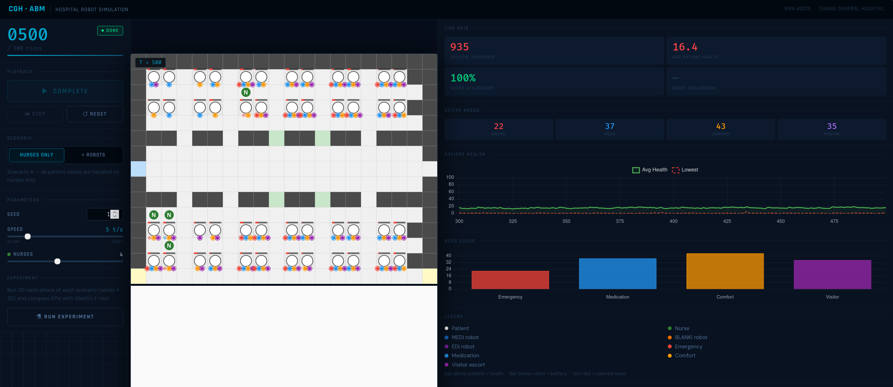

# CGH Hospital Robot ABM

An agent-based simulation comparing nurse-only versus nurse-plus-robot staffing in a hospital ward, modelled on the Emergency Department at Changi General Hospital (CGH), Singapore.



---

## Background

In July 2023, Changi General Hospital deployed three autonomous mobile robots — **MEDi** (medication transport), **BLANKi** (comfort items), and **EDi** (visitor escort) — in its Emergency Department as part of its broader 80+ robot fleet. The core hypothesis is that robots offloading non-clinical tasks free nurses to focus on emergencies, reducing critical incidents and improving response times.

This simulation tests that hypothesis by running a discrete-event ABM of a 32-bed ward under two conditions: **Scenario A** (nurses only) and **Scenario B** (same nurses plus a configurable robot fleet). Patient outcomes are compared across 30 statistically independent replications using Welch's t-test.

---

## How to Run

ES modules require a local server — you cannot open `index.html` directly from the filesystem (`file://` protocol blocks module imports). Start a server in the project root:

```bash
python -m http.server 8080
```

Then open `http://localhost:8080` in your browser.

**Supported browsers:** Chrome 90+, Firefox 90+, Safari 15+, Edge 90+. WebGL must be enabled (required by Pixi.js).

No npm, no build step, no installation. All libraries load from CDN on first open.

---

## How to Use the Simulation

### Controls (left panel)

| Control | What it does |
|---------|-------------|
| **Scenario toggle** | Switch between **Nurses Only (A)** and **Nurses + Robots (B)**. Takes effect on next Reset. |
| **Play / Pause** | Start or pause the tick loop. The button pulses while running. |
| **Step** | Advance exactly one tick while paused — useful for inspecting individual agent decisions. |
| **Reset** | Restart from tick 0 with the current scenario, seed, and staffing settings. |
| **Speed slider** | Controls how fast ticks fire visually (50 ms = fast, 1000 ms = slow). Has no effect on headless batch runs. |
| **Nurses slider** | Number of nurse agents (1–8). |
| **MEDi / BLANKi / EDi sliders** | Fleet size for each robot type (0–6 each). Only visible in Scenario B. |
| **Seed input** | Integer seed for the PRNG. Two runs with the same seed and settings are identical. |
| **Run Experiment** | Opens the batch experiment modal (see below). |

The tick counter in the top-left of the panel shows the current tick (`0000`–`0500`) and a progress bar. The status pill shows **INIT** (renderer loading), **READY** (paused), **LIVE** (running), or **DONE** (run complete).

### Simulation canvas (centre)

The canvas renders a 20 × 15 ward grid. Each tick represents **30 seconds** of real ward time; a full 500-tick run covers approximately 4 hours of operation.

**Cell colours:**

| Colour | Cell type |
|--------|-----------|
| Light grey | Corridor (walkable) |
| Dark grey | Wall (impassable) |
| White/off-white | Patient bed |
| Light green | Nurse station |
| Light yellow | Charging bay |
| Light blue | Entrance |

**Agents** are colour-coded circles:

| Colour | Agent |
|--------|-------|
| White with outline | Patient (stationary at bed) |
| Green | Nurse |
| Blue | MEDi robot |
| Orange | BLANKi robot |
| Purple | EDi robot |

**Health bar** — the bar above each patient runs from green (healthy) through amber to red. When a patient's health reaches 0 a critical incident is logged and health resets to 30.

**Battery bar** — the bar below each robot shows charge level. When it drops below 20% the robot abandons its current task and navigates to the nearest charging bay.

**Need dots** — small coloured dots below each patient indicate active unmet needs: red = emergency, blue = medication, orange = comfort, purple = visitor escort. A dot with a ring is open (unclaimed); a dimmed dot is already claimed by an agent en route.

### Charts (right panel)

- **Live KPIs** — critical incident count, average patient health, nurse utilisation %, and robot utilisation % (shown as `—` in Scenario A).
- **Active Needs** — live count of currently open/claimed needs by type.
- **Patient Health chart** — rolling 200-tick line chart of mean patient health.
- **Need Queue chart** — bar chart of active need counts by type, updated every tick.

---

## Batch Experiments

Click **Run Experiment** in the left panel to open the experiment modal.

Pressing **Start Experiment** runs:
1. 30 headless replications of Scenario A (seeds 1–30)
2. 30 headless replications of Scenario B (seeds 1–30)

"Headless" means no rendering — the Scheduler runs at full speed with no visual output, so all 60 replications typically complete in a few seconds. A progress bar tracks completion.

When finished the modal displays a results table with one row per KPI:

| Column | Description |
|--------|-------------|
| **A Mean** | Mean across 30 Scenario A replications |
| **A 95% CI** | Confidence interval using the t-distribution (df = 29) |
| **B Mean / CI** | Same for Scenario B |
| **Δ (B−A)** | Difference; negative = Scenario B improved the metric |
| **p value** | Exact two-tailed p-value from Welch's t-test |
| **Sig.** | Stars: `***` p < 0.001 · `**` p < 0.01 · `*` p < 0.05 · `†` p < 0.10 · `ns` otherwise |

Click **Export CSV** to download `cgh_abm_experiment_results.csv` with the full results table. Click **Re-run** to repeat the experiment.

> The warm-up period (first 50 ticks) is automatically discarded from all per-replication statistics, so the comparison reflects steady-state operation only.

---

## Project Structure

```
sma-40015-final-project/
│
├── index.html                     # Single-page app — Alpine component, CSS, CDN scripts
├── src/
│   ├── config.js                  # All tunable parameters (single source of truth)
│   │
│   ├── simulation/                # Pure simulation engine — no DOM, no Pixi
│   │   ├── Scheduler.js           # Tick loop, 8-step execution order, headless run()
│   │   ├── Grid.js                # Ward grid, BFS pathfinding, cell-type queries
│   │   ├── NeedQueue.js           # Global need registry — claim, unclaim, fulfil
│   │   ├── Agent.js               # Base agent class (position, movement, BFS path)
│   │   ├── Patient.js             # Need generation, health drain, critical incidents
│   │   ├── Nurse.js               # Urgency-weighted scoring and decision-making
│   │   ├── RobotMEDi.js           # Medication transport robot with battery mechanics
│   │   ├── RobotBLANKi.js         # Comfort-items robot with battery mechanics
│   │   ├── RobotEDi.js            # Visitor escort robot with ACCOMPANYING state
│   │   ├── SeededRandom.js        # Linear congruential PRNG (reproducible runs)
│   │   ├── Stats.js               # Per-tick KPI collection and replication summary
│   │   └── BatchRunner.js         # Headless 30-replication runner for experiments
│   │
│   ├── rendering/                 # Pixi.js visual layer — observes simulation, never modifies it
│   │   ├── Renderer.js            # Pixi app init, animation frame loop, tick throttling
│   │   ├── GridRenderer.js        # Ward grid cells drawn once at startup
│   │   ├── AgentSprites.js        # Agent circles, labels, need dots, lerp animation
│   │   ├── HealthBarRenderer.js   # Patient health bars and robot battery bars
│   │   └── ChartManager.js        # Chart.js line and bar chart setup and updates
│   │
│   ├── ui/                        # Alpine.js integration layer
│   │   ├── ControlPanel.js        # Wires Renderer and ScenarioManager to Alpine reactive state
│   │   ├── ScenarioManager.js     # Translates UI settings into Renderer.reset() calls
│   │   └── ExperimentPanel.js     # runExperiment() and exportCSV() for batch comparison
│   │
│   └── analysis/
│       └── Statistics.js          # descriptive(), welchTest(), sigStars() — pure functions
│
├── docs/
│   └── SIMULATION_SPEC.md         # Authoritative simulation specification
│
└── test/
    ├── smoke-test.js              # Quick sanity check — one replication, prints KPIs
    └── verify-phase1.js           # 46 behavioural invariant tests for the simulation engine
```

---

## Simulation Design

### Tick Execution Order

Each tick runs these eight steps in strict order — reordering them would introduce race conditions:

1. **Need generation** — each patient independently rolls for each need type
2. **Robot decisions** — idle robots scan the NeedQueue and claim the nearest matching need (robots cannot see emergency needs)
3. **Nurse decisions** — idle nurses score unclaimed needs by `urgency × wait_time / distance` and claim the highest scorer
4. **Movement** — all agents in a MOVING state advance one cell along their BFS path
5. **Task execution** — agents at their target decrement remaining service time
6. **State transitions** — completed tasks free the agent; fulfilled needs restore patient health; robot batteries update
7. **Health drain** — patients lose health for each still-unfulfilled need (rate varies by type)
8. **Stats collection** — KPIs are recorded for this tick

Robots decide before nurses (step 2 before step 3) so that in Scenario B, robots pre-empt non-emergency needs, leaving nurses free when emergencies arise.

### Agent Types

| Agent | Moves | Handles | Special behaviour |
|-------|-------|---------|-------------------|
| **Patient** | No | — | Generates needs, tracks health (0–100), logs critical incident at health = 0 |
| **Nurse** | Yes | All need types including emergencies | Scores needs by urgency × wait / distance |
| **MEDi** | Yes | Medication only | Abandons task and goes to charge when battery < 20 |
| **BLANKi** | Yes | Comfort only | Same battery mechanics |
| **EDi** | Yes | Visitor escort only | Travels to entrance first, then to bed; enters ACCOMPANYING state (20–60 ticks) after escort |

### Core Constraint

**Emergencies can only be handled by nurses.** The NeedQueue filters emergency needs out of every robot's query. This is the mechanism by which robots add value — they absorb the non-critical workload so nurse capacity is preserved for life-threatening situations.

### KPIs Measured

Collected per replication over ticks 50–500 (warm-up discarded):

| KPI | Description |
|-----|-------------|
| Critical incident count | Times any patient's health hit 0 |
| Mean emergency response time | Ticks from emergency creation to nurse arrival |
| Mean wait time (per need type) | Ticks from need creation to service start |
| Unfulfilled needs at end of run | Needs still open when the simulation ends |
| Mean nurse utilisation | Fraction of ticks nurses were busy |
| Mean robot utilisation | Fraction of ticks robots were active (not idle or charging) |

Full specification in [`docs/SIMULATION_SPEC.md`](docs/SIMULATION_SPEC.md).

---

## Tech Stack

| Layer | Library | Notes |
|-------|---------|-------|
| Simulation canvas | [Pixi.js](https://pixijs.com) v8 | WebGL-accelerated 2D rendering |
| Charts | [Chart.js](https://www.chartjs.org) v4 | Real-time line and bar charts |
| UI reactivity | [Alpine.js](https://alpinejs.dev) v3 | Declarative control panel bindings |
| Styling | [Tailwind CSS](https://tailwindcss.com) CDN | Utility classes, no build step |
| Simulation engine | Vanilla JS ES modules | Custom tick scheduler, BFS pathfinding, seeded PRNG |

Everything loads from cdn.jsdelivr.net via `<script>` tags. There is no package.json, no node_modules, no bundler.

---

## Configuration

All parameters are in `src/config.js`. The most useful ones to experiment with:

```javascript
// Staffing — also adjustable at runtime via the UI sliders
NURSE_COUNT:    4,   // nurses in both scenarios
MEDI_COUNT:     2,   // MEDi robots (Scenario B only)
BLANKI_COUNT:   2,   // BLANKi robots (Scenario B only)
EDI_COUNT:      2,   // EDi robots (Scenario B only)

// Simulation length
TICKS_PER_RUN:  500, // 500 ticks × 30 s/tick ≈ 4 hours of ward time
WARM_UP_TICKS:  50,  // first 50 ticks discarded from statistics

// Need spawn rates (probability per patient per tick)
NEED_SPAWN_RATE: {
  emergency:      0.005,  // rare but critical
  medication:     0.02,
  comfort:        0.04,
  visitor_escort: 0.015,
},

// Health drain per tick per active unfulfilled need
HEALTH_DRAIN_PER_TICK: {
  emergency:     2.0,     // patient deteriorates quickly
  medication:    0.8,
  comfort:       0.3,
  visitor_escort: 0.1,
},

// Experiment
REPLICATION_COUNT:  30,
RANDOM_SEED_START:  1,    // uses seeds 1–30 for the 30 replications
```

Adjusting `NEED_SPAWN_RATE` changes ward busyness. Increasing `NURSE_COUNT` without adding robots tests whether extra nurses alone produce the same gains as Scenario B. Reducing `TICKS_PER_RUN` speeds up exploratory batch runs.

Changes to `config.js` take effect on the next Reset or batch run — no page reload required.
