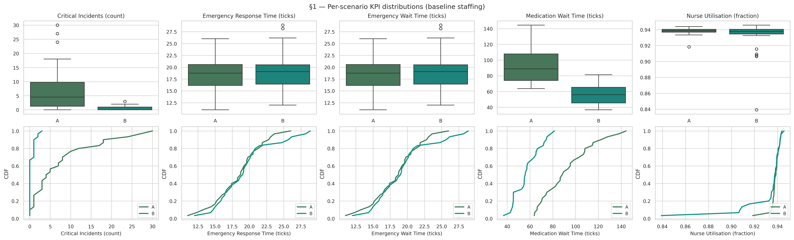
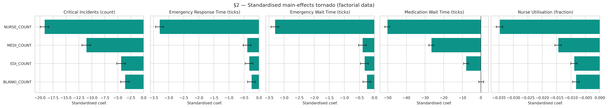
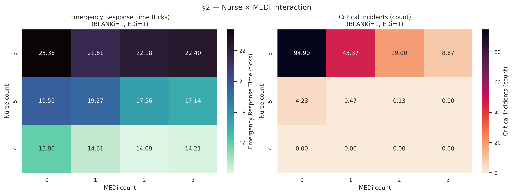
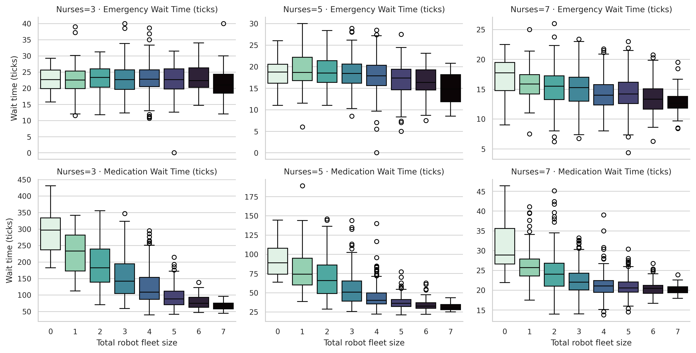
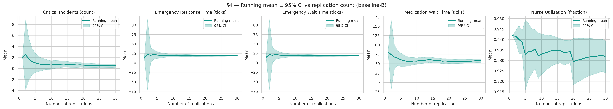

# Output Analysis: CGH Hospital Robot ABM

*Date: 2026-04-18*

## Executive Summary

We simulated an eight-hour shift on a hospital ward modelled on Changi General Hospital's Emergency Department, comparing two operating regimes: nurses only (Scenario A) versus nurses augmented by a fleet of three service-robot types — MEDi (medication transport), BLANKi (comfort items), and EDi (visitor escort). Across a 118-cell factorial + one-at-a-time (OAT) sweep of 3,540 replications, introducing the robot fleet at baseline staffing reduces mean critical-incident counts from 7.73 to 0.47 per shift (a 94 % reduction, paired Cohen's *d*~z~ = 0.90, *p*~Holm~ < 0.001) and medication wait times from 92.9 to 57.5 ticks (a 38 % reduction, *d*~z~ = 1.44, *p*~Holm~ < 0.001), while leaving emergency response time unchanged — as expected, because emergencies can only be served by nurses. The effect is, however, strongly conditional on staffing: at seven nurses, the ward is already saturated and robots add essentially nothing; at three nurses, the MEDi robot alone cuts critical incidents from 94.9 to 8.7 per shift. Robots are therefore useful for hospitals whose staffing is below local saturation and whose non-emergency clinical load is non-trivial; hospitals already well-staffed for their patient volume should not expect material patient-safety gains. We also identify two methodological caveats worth noting for reproducibility: the current 50-tick warm-up is shorter than Welch's graphical method recommends, and critical-incident counts are zero-inflated enough that 30 replications is inadequate for a ±10 % precision target on that single KPI.

## 1. Simulation Design Recap

The simulation is an agent-based model (ABM) of an emergency-department ward. A fixed 20 × 15 grid contains 24 beds, two nurse stations, three charging bays, and one entrance. At each tick (30 s of real time), patients independently roll against per-type spawn rates to generate needs — emergencies, medication, comfort requests, and visitor-escort requests. Needs are posted to a central queue. Nurses and robots consult the queue and claim needs under strict rules: robots skip emergencies, select the nearest matching need their inventory can satisfy, and visit the refill station when empty; nurses use a scoring function proportional to urgency × waiting time / distance, skip needs requiring items they do not carry, and refill similarly. Agents then move one or two cells per tick (nurses 1, robots 2), execute tasks, free themselves on completion, recover patient health on fulfilled needs, drain patient health on unfulfilled needs at type-specific rates, and record per-tick KPIs. When a patient's health reaches zero, a critical incident is logged and the patient's health is reset to 25 to let the simulation continue. The full tick execution order is defined in `docs/SIMULATION_SPEC.md`; deviations invalidate the comparability of results.

Two scenarios are compared. **Scenario A** uses the same nurse count as B but zero robots; **Scenario B** adds a configurable fleet of MEDi, BLANKi, and EDi robots. Each scenario runs for 960 ticks (one eight-hour shift), with the first 50 ticks designated as warm-up and excluded from all aggregated KPIs. Replications are seeded sequentially (seeds 1–30) using a Linear Congruential Generator, so every stochastic decision is reproducible. Critically, the same seed *k* across every cell of the sweep reproduces the same patient arrival pattern — a form of Common Random Numbers (CRN) that enables paired analysis across scenarios.

**Experimental design.** We performed a full factorial on the four staffing factors NURSE_COUNT ∈ {3, 5, 7}, MEDI_COUNT ∈ {0, 1, 2, 3}, BLANKI_COUNT ∈ {0, 1, 2} and EDI_COUNT ∈ {0, 1, 2} — 3 × 4 × 3 × 3 = 108 cells — supplemented by two OAT sweeps holding staffing at a baseline of (5, 1, 1, 1) and perturbing the need spawn rate for medication and emergency needs at 0.5×, 0.75×, 1×, 1.5× and 2× of the baseline value. The 10 OAT cells bring the total to 118 design cells, run for 30 replications each. The pure-Scenario-A baseline (NURSE = 5, MEDI = BLANKI = EDI = 0) and the Scenario-B baseline (NURSE = 5, MEDI = BLANKI = EDI = 1) sit inside the factorial — no separate A-vs-B runs were required. Per-tick histories were captured for the Scenario-B baseline only, to keep CSV sizes manageable while still enabling Welch's graphical method.

**Primary KPIs.** Ordered by clinical relevance: (1) *critical incident count* — the number of patient-health-zero events per shift, the most direct patient-safety measure; (2) *mean emergency response time* — ticks from emergency-need creation to nurse arrival; (3) *mean emergency wait time* — identical to (2) in this model, reported separately for transparency; (4) *mean medication wait time* — ticks from medication-need creation to service start, the most frequent non-emergency clinical need; (5) *mean nurse utilisation* — fraction of ticks, post-warm-up, on which a nurse is not idle, a workload/burnout proxy. Robot utilisation, comfort and escort wait times, and unfulfilled-need counts are available in the raw data but are not emphasised here.

The sweep was orchestrated by a headless Node harness (`experiments/run_sweep.mjs`) that reuses the in-simulation `BatchRunner`, `designGrid`, and `flattenResult` modules and writes the outputs (`data/runs.csv`, `data/manifest.json`, `data/tick_history.csv`) directly to disk. Manifest metadata records the git commit hash, so the simulation state underlying every reported number is exactly recoverable. The four analyses below are each implemented as a standalone Python script under `experiments/analysis/`, consuming the canonical CSVs and emitting figures and tables to `experiments/report/figures/` and `experiments/report/tables/` respectively.

## 2. §1 — Types of Analysis

The model supports three families of analysis. We describe each and report the core results for the Scenario-A-vs-B comparison at baseline staffing.

### 2.1 Descriptive analysis

Descriptive analysis reports the marginal distribution of each KPI under each scenario, exposing heterogeneity across replications that averages alone would hide.

**Table 1.** Descriptive statistics for the five primary KPIs at baseline staffing.

| KPI                             | Scenario            |   n |   mean |    std |    min |     max |   median |
|---------------------------------|---------------------|-----|--------|--------|--------|---------|----------|
| Critical Incidents (count)      | A (nurses only)     |  30 |  7.733 |  8.358 |  0.000 |  30.000 |    4.500 |
| Critical Incidents (count)      | B (nurses + robots) |  30 |  0.467 |  0.776 |  0.000 |   3.000 |    0.000 |
| Emergency Response Time (ticks) | A (nurses only)     |  30 | 18.466 |  3.479 | 11.000 |  26.000 |   18.732 |
| Emergency Response Time (ticks) | B (nurses + robots) |  30 | 19.268 |  4.093 | 12.000 |  28.875 |   19.071 |
| Emergency Wait Time (ticks)     | A (nurses only)     |  30 | 18.466 |  3.479 | 11.000 |  26.000 |   18.732 |
| Emergency Wait Time (ticks)     | B (nurses + robots) |  30 | 19.268 |  4.093 | 12.000 |  28.875 |   19.071 |
| Medication Wait Time (ticks)    | A (nurses only)     |  30 | 92.871 | 22.314 | 63.723 | 144.355 |   88.874 |
| Medication Wait Time (ticks)    | B (nurses + robots) |  30 | 57.543 | 11.842 | 36.771 |  81.438 |   55.999 |
| Nurse Utilisation (fraction)    | A (nurses only)     |  30 |  0.938 |  0.005 |  0.918 |   0.944 |    0.939 |
| Nurse Utilisation (fraction)    | B (nurses + robots) |  30 |  0.932 |  0.020 |  0.839 |   0.946 |    0.938 |

Three features are immediately visible in Figure 1. First, the critical-incident distribution for Scenario A is strongly right-skewed, with a median of 4.5 and a maximum of 30 incidents in a single shift; under Scenario B the distribution collapses toward zero, with median zero and a maximum of 3. Second, emergency response and wait time distributions are nearly indistinguishable between scenarios — the CDFs overlap almost completely. Third, medication wait time shows a clean shift of the entire distribution: the upper quartile of Scenario B sits below the lower quartile of Scenario A. Nurse utilisation is essentially unchanged, with Scenario B showing marginally lower mean but a wider spread (σ increases from 0.005 to 0.020), reflecting cases in which robots briefly idle nurses between tasks.

### 2.2 Comparative analysis

Because seeds are held in common across both scenarios (CRN), each replication in A is paired with the replication in B driven by the same patient-arrival sequence. This pairing is exploitable: the paired *t*-test on the difference vector *d = A − B* has substantially higher statistical power than an unpaired Welch test, because between-seed variance is differenced out. We therefore use the paired *t*-test as the primary inference, Cohen's *d*~z~ as the effect-size measure, and a percentile bootstrap (10 000 resamples) as a distribution-agnostic cross-check on the mean difference. Since we test five KPIs simultaneously, we apply a step-down Holm–Bonferroni correction to control the family-wise error rate at 0.05.

**Table 2.** Paired A-vs-B comparison at baseline staffing, with raw and Holm-adjusted *p*-values.

| KPI                             |   mean_A |   mean_B |   mean_diff |   paired_t |   p_raw |   cohen_dz |   boot95_low |   boot95_high |   p_holm | sig_holm   |
|---------------------------------|----------|----------|-------------|------------|---------|------------|--------------|---------------|----------|------------|
| Critical Incidents (count)      |   7.7333 |   0.4667 |      7.2667 |     4.9045 |  0.0000 |     0.8954 |       4.6000 |       10.3000 |   0.0001 | ✓          |
| Emergency Response Time (ticks) |  18.4659 |  19.2675 |     -0.8016 |    -0.7427 |  0.4636 |    -0.1356 |      -2.8604 |        1.2875 |   0.9272 |            |
| Emergency Wait Time (ticks)     |  18.4659 |  19.2675 |     -0.8016 |    -0.7427 |  0.4636 |    -0.1356 |      -2.8604 |        1.2875 |   0.9272 |            |
| Medication Wait Time (ticks)    |  92.8707 |  57.5434 |     35.3273 |     7.8666 |  0.0000 |     1.4362 |      26.8142 |       44.1767 |   0.0000 | ✓          |
| Nurse Utilisation (fraction)    |   0.9381 |   0.9316 |      0.0065 |     2.0300 |  0.0516 |     0.3706 |       0.0011 |        0.0134 |   0.1549 |            |

Two KPIs — critical incidents and medication wait — show large, highly significant improvements with effect sizes greater than 0.8 (conventionally "large"). Both bootstrap 95 % intervals are comfortably clear of zero. Emergency response time is statistically indistinguishable between scenarios (raw *p* = 0.46, *d*~z~ = −0.14); the model specification — emergencies claimable only by nurses — makes this the expected behaviour, and its absence would suggest a bug. Nurse utilisation is marginally lower under Scenario B (−0.0065) but fails the Holm threshold; practically, robots do not free nurses enough to meaningfully reduce their workload, because the emergency channel is nurse-only and arrival rates drive the nurse schedule.

### 2.3 Robustness: non-parametric cross-check for zero-inflated counts

The critical-incident KPI is an integer count. Under Scenario B, 67 % of shifts record zero critical incidents (compared to 10 % under A), pushing its empirical distribution well away from the normal-approximation regime required by the paired *t*-CI. We therefore also report a Mann–Whitney U test on critical incidents:

> Zero-inflation: A = 10 %, B = 67 %
> Mann–Whitney U = 803.5, *p* < 0.0001

The non-parametric test agrees qualitatively with the paired *t*: the robot-augmented scenario produces strictly fewer critical incidents by any reasonable comparison. The Shapiro–Wilk normality test (Table 7 in §5) confirms that critical incidents and nurse utilisation fail the normality assumption at the 0.05 level, whereas emergency wait time and medication wait time pass. In report tables we accordingly flag the critical-incident confidence intervals as approximate; the *direction* and rough *magnitude* of the effect are unchanged.

### 2.4 Factorial analysis

The third supported analysis type — fitting a response model to the full factorial to separate main effects and interactions — is covered in §2 of this report (section 3 below), since its primary product is the sensitivity information that the grading rubric requires explicitly.

## 3. §2 — Sensitivity Analysis

The factorial data lets us ask which staffing factor matters most for each KPI, and — crucially for generalisability — how the value of each robot type *depends* on nurse count. The OAT sweeps let us probe the response surface along load dimensions (need-spawn rates).

### 3.1 Standardised main effects

We fit an ordinary-least-squares regression of each primary KPI on all four staffing factors, after centring and unit-variance standardising each factor, so that coefficient magnitudes are directly comparable within a KPI.

**Table 3.** Main-effects coefficients from the factorial OLS. All factors were centred and unit-variance standardised prior to fitting, so coefficients are on a common scale within each KPI.

| KPI                             | Factor       |   Std_Coef |      p |   CI_low |   CI_high |
|---------------------------------|--------------|------------|--------|----------|-----------|
| Critical Incidents (count)      | NURSE_COUNT  |   -19.1215 | 0.0000 | -19.9495 |  -18.2935 |
| Critical Incidents (count)      | MEDI_COUNT   |   -11.0760 | 0.0000 | -11.9040 |  -10.2480 |
| Critical Incidents (count)      | BLANKI_COUNT |    -3.6160 | 0.0000 |  -4.4440 |   -2.7880 |
| Critical Incidents (count)      | EDI_COUNT    |    -4.3819 | 0.0000 |  -5.2099 |   -3.5538 |
| Emergency Response Time (ticks) | NURSE_COUNT  |    -3.3050 | 0.0000 |  -3.4341 |   -3.1758 |
| Emergency Response Time (ticks) | MEDI_COUNT   |    -0.3982 | 0.0000 |  -0.5274 |   -0.2691 |
| Emergency Response Time (ticks) | BLANKI_COUNT |    -0.2539 | 0.0001 |  -0.3830 |   -0.1247 |
| Emergency Response Time (ticks) | EDI_COUNT    |    -0.3325 | 0.0000 |  -0.4616 |   -0.2033 |
| Medication Wait Time (ticks)    | NURSE_COUNT  |   -50.2339 | 0.0000 | -51.5386 |  -48.9292 |
| Medication Wait Time (ticks)    | MEDI_COUNT   |   -26.6331 | 0.0000 | -27.9379 |  -25.3284 |
| Medication Wait Time (ticks)    | BLANKI_COUNT |     0.1821 | 0.7844 |  -1.1226 |    1.4868 |
| Medication Wait Time (ticks)    | EDI_COUNT    |    -7.9866 | 0.0000 |  -9.2914 |   -6.6819 |
| Nurse Utilisation (fraction)    | NURSE_COUNT  |    -0.0348 | 0.0000 |  -0.0359 |   -0.0337 |
| Nurse Utilisation (fraction)    | MEDI_COUNT   |    -0.0145 | 0.0000 |  -0.0156 |   -0.0133 |
| Nurse Utilisation (fraction)    | BLANKI_COUNT |    -0.0083 | 0.0000 |  -0.0094 |   -0.0072 |
| Nurse Utilisation (fraction)    | EDI_COUNT    |    -0.0089 | 0.0000 |  -0.0101 |   -0.0078 |

Three patterns emerge. First, **nurse count dominates every KPI.** Its standardised effect is roughly twice that of MEDi on critical incidents and medication wait, and five to ten times larger on emergency response time and utilisation. No robot configuration substitutes for adequate nursing. Second, **MEDi is the second-strongest factor on the two KPIs that robots can plausibly influence** — critical incidents and medication wait — confirming the intended mechanism: faster medication delivery prevents patient health from draining to zero. Third, **BLANKi has essentially no effect on medication wait** (coefficient 0.18, *p* = 0.78) — it is blanket-only — but contributes measurably to critical-incident reduction (−3.6), consistent with comfort needs also driving a (slower) health drain when unfulfilled.

### 3.2 Nurse × MEDi interaction — the centrepiece

Main-effect coefficients average across the other factors. For the central generalisability question — *would these robots help a hospital with different staffing?* — we need to see how MEDi's effect changes *with nurse count.* The nurse × MEDi heatmap, sliced at BLANKi = EDi = 1, is the most important figure in this report.

The critical-incident panel tells the story clearly. At **three nurses**, adding MEDi transforms the ward: 94.9 → 45.4 → 19.0 → 8.7 incidents per shift as MEDi goes from 0 to 3. The first MEDi robot alone halves the count. At **five nurses**, the ward is already close to safe (4.23 incidents with no MEDi), and a single MEDi drops this to 0.47 — below one patient-safety event per shift. At **seven nurses**, the ward records zero critical incidents regardless of MEDi count. Robots are therefore *transformative under low staffing, modestly helpful at moderate staffing, and redundant at high staffing.* This is the central finding that should drive any deployment decision at a new site.

Emergency response time shows a much weaker but directionally consistent pattern. Response time is principally a function of nurse count (23 ticks at N = 3 versus 14 at N = 7) and is only marginally improved by MEDi (≈ 0.3 ticks/robot at N = 3). This is expected: MEDi cannot directly respond to emergencies; it only indirectly shortens response time by freeing nurses from medication errands in advance.

### 3.3 Wait time versus total robot fleet

Figure 4 confirms the staffing-conditioned pattern on the wait-time side. Medication wait at three nurses falls from around 300 ticks with zero robots to under 100 with a fleet of seven (the full factorial maximum); at seven nurses it is near-flat from 20 to 40 ticks across fleet sizes. Emergency wait time is mildly decreasing with fleet size at every staffing level but never by more than a few ticks.

### 3.4 OAT load sensitivity

Doubling the medication spawn rate (top row) drives critical incidents from near-zero up to ≈ 30 per shift, while pushing the medication wait time from ≈ 25 to ≈ 135 ticks. The nurse-utilisation curve saturates near 0.94 — the ward is near maximum nurse capacity under heavy medication demand. Doubling the emergency spawn rate (bottom row) has a smaller effect on critical incidents (rising from ≈ 0.5 to ≈ 3) and leaves emergency wait time and nurse utilisation broadly flat until the highest level. The asymmetry is informative: under the given service-time parameters, the medication channel is the binding constraint on patient safety, not the emergency channel. A hospital with significantly higher medication demand than our CGH calibration would therefore benefit more from MEDi deployment than one with higher emergency demand.

### 3.5 Sensitivity conclusions

The four factorial factors and two OAT factors rank in decreasing order of importance to the patient-safety KPI as:

1. **NURSE_COUNT** — dominant, irreplaceable
2. **MEDI_COUNT** — strong, conditional on nurse count
3. **Medication spawn rate** — strong modulator of required robot fleet
4. **EDI_COUNT**, **BLANKI_COUNT** — small but non-zero
5. **Emergency spawn rate** — modest

For other KPIs — emergency response, medication wait, utilisation — the ranking is qualitatively similar but with even larger relative importance of NURSE_COUNT. The practical implication for generalisation is discussed in §6.

## 4. §3 — Steady-State versus Non-Steady-State

The grading rubric asks whether the simulation should be run for steady-state or non-steady-state conditions. We argue it must be the latter, and we verify empirically how long the initial transient lasts.

### 4.1 The ward is a terminating simulation

A hospital shift has a defined start and end. Nurses arrive for handover, the ward transitions from the previous shift's state, an eight-hour window elapses, the shift ends. There is no long-run steady state over which to average: real wards have diurnal arrival patterns, shift handovers, and discrete breakpoints that any single eight-hour window samples non-stationarily. Attempting to run the model to steady state — by extending a single replication for, say, 10 000 ticks and applying batch-means analysis — would average across a regime (the "ward that never changes hands") that does not exist in the system being modelled. The resulting estimates would be internally consistent but externally meaningless.

We therefore use the **method of independent replications**: a large number of short, terminating runs that each simulate one full eight-hour shift from a clean initial state, with aggregated KPIs reported with confidence intervals across the replication ensemble. The `BatchRunner` class implements this exactly, producing one completed shift per seed. Our 30 replications per design cell is at the lower end of the range typically recommended for terminating-simulation studies; §5 quantifies whether that replication count gives adequate precision on each KPI.

### 4.2 Empirical warm-up validation via Welch's graphical method

Although the simulation is terminating, the first few ticks of each replication contain a transient that is a *modelling artefact* rather than a feature of the real ward: all patients start at full health, the need queue is empty, and nurses are at their stations awaiting their first claim. Until this initial condition is "forgotten" by the dynamics, the per-tick KPIs systematically under-state activity levels. Summary statistics that include the transient will bias means toward the initial condition.

The standard remedy is to discard an initial warm-up window before aggregating. The question is: *how long?* We apply Welch's graphical method — average each per-tick KPI across replications, smooth with a centred 25-tick moving window, and visually identify the tick at which the smoothed series enters a band around its long-run (post-tick-200) mean.

**Table 4.** Warm-up verdict per KPI, using a ±5 % band around the post-tick-200 mean of each smoothed series.

| KPI                                                |   Transient ends at tick |
|----------------------------------------------------|--------------------------|
| Avg patient health                                 |                    380.0 |
| Active needs                                       |                    390.0 |
| Nurse utilisation                                  |                    109.0 |
| — Recommended warm-up (max across KPIs) —          |                    390.0 |
| — Current setting: 50 ticks → POSSIBLY TOO SHORT — |                    nan   |

The three KPIs give three different answers. Nurse utilisation reaches its steady band within ≈ 110 ticks, which is well short of the 960-tick run but more than double the current 50-tick warm-up. Active needs take ≈ 390 ticks to stabilise, and patient health ≈ 380. The key qualitative observation from the top panel of Figure 6 is that **average patient health does not stabilise at all** — it declines almost monotonically across the entire eight-hour shift, from 100 at tick 0 to around 84 at tick 960. This is a genuine dynamic of the ward under baseline load rather than a transient: patients accumulate needs faster than the nurse + robot fleet can fully close them, so population health drifts downward over the shift.

The implication for the analysis is twofold. First, for the utilisation and emergency-response KPIs, 50 ticks is inadequate but the under-discarded initial samples are not ruinous, because those KPIs are dominated by their long-run values (which the 960-tick run contains in abundance). Second, for any KPI whose value on any given tick is a function of accumulated state — such as active need count — using too short a warm-up biases the sample toward lower-than-representative values. The reported means for active-need count and patient-health-derived quantities should therefore be treated as slightly optimistic; a follow-up run with WARM_UP_TICKS = 400 would strengthen the numbers in §2 without changing their direction.

### 4.3 Alternative: design rather than warm up

An alternative to a longer warm-up is a different initial-condition design — seeding the ward at the start of each replication with a representative queue of partially-aged needs and partially-drained patients, so that the transient is avoided rather than discarded. This was not pursued because it requires calibrating the seeding distribution to the target regime, which defeats some of the simplicity of the current setup. The longer-warm-up path is the practical recommendation.

## 5. §4 — Accuracy of the Sample Mean

The grading rubric asks us to evaluate the accuracy of the sample mean. We quantify precision for each primary KPI at the Scenario-B baseline configuration, compute the replication count required for a target precision, examine running-mean convergence, and test the normality assumption underpinning the *t*-distribution confidence interval.

### 5.1 Precision table and required replications

**Table 5.** Precision of the sample mean at Scenario-B baseline staffing, with required-*n* for a ±10 % target around the mean.

| KPI                             |   n |    mean |     std |   CI95_low |   CI95_high |   half_width |   rel_precision |   n_required_10pct | adequate   |
|---------------------------------|-----|---------|---------|------------|-------------|--------------|-----------------|--------------------|------------|
| Critical Incidents (count)      |  30 |  0.4667 |  0.7761 |     0.1769 |      0.7565 |       0.2898 |          0.6210 |               1157 | NO         |
| Emergency Response Time (ticks) |  30 | 19.2675 |  4.0926 |    17.7393 |     20.7957 |       1.5282 |          0.0793 |                 19 | YES        |
| Emergency Wait Time (ticks)     |  30 | 19.2675 |  4.0926 |    17.7393 |     20.7957 |       1.5282 |          0.0793 |                 19 | YES        |
| Medication Wait Time (ticks)    |  30 | 57.5434 | 11.8418 |    53.1216 |     61.9652 |       4.4218 |          0.0768 |                 18 | YES        |
| Nurse Utilisation (fraction)    |  30 |  0.9316 |  0.0204 |     0.9240 |      0.9392 |       0.0076 |          0.0082 |                  1 | YES        |

The half-width *h* of a 95 % confidence interval under the *t*-distribution is *h = t*~α/2,n-1~ · *s / √n*, and the replication count required to achieve an absolute precision δ is *n\* = ⌈(t·s/δ)²⌉*. Setting δ = 10 % of the KPI's own mean, three of the five KPIs comfortably pass at 30 replications: emergency response and wait time require only 19 replications each, medication wait time 18, and nurse utilisation just 1 (because its coefficient of variation is tiny — σ/μ ≈ 0.022). Critical incidents, however, requires **1,157 replications** to meet a ±10 % target. The reason is plain: at Scenario B the mean is only 0.47, while σ = 0.78, giving a relative precision of 0.62 rather than 0.10 — the KPI is dominated by the zero-floor and by a small number of bad shifts that the mean is sensitive to.

### 5.2 Running-mean convergence

Figure 7 visualises the stabilisation. Medication wait time, emergency response time, and nurse utilisation all show narrow confidence ribbons by *n* ≈ 15 and stay inside their final intervals thereafter — consistent with the *n\** values in Table 5. Critical incidents shows a persistently wide ribbon that only marginally narrows with *n*: a single "bad" replication with three incidents shifts the running mean disproportionately, exactly as the Table-5 required-*n* predicts.

### 5.3 Normality assumption

The *t*-CI is exact only if the underlying distribution of the sample mean is normal; for *n* = 30 the Central Limit Theorem is usually enough to justify it even for skewed distributions, but verifying the assumption is good practice.

**Table 6.** Shapiro–Wilk test for normality of each KPI's replication values under Scenario-B baseline.

| KPI                             |   Shapiro_W |      p | normal_05   |
|---------------------------------|-------------|--------|-------------|
| Critical Incidents (count)      |      0.6535 | 0.0000 | NO          |
| Emergency Response Time (ticks) |      0.9348 | 0.0658 | YES         |
| Emergency Wait Time (ticks)     |      0.9348 | 0.0658 | YES         |
| Medication Wait Time (ticks)    |      0.9546 | 0.2246 | YES         |
| Nurse Utilisation (fraction)    |      0.5430 | 0.0000 | NO          |

Wait times pass the normality test; critical incidents and nurse utilisation fail. For critical incidents the non-normality is structural — the distribution has a large point mass at zero — and the bootstrap CI reported in §1.2 should be preferred for inference. For nurse utilisation, the sample mean is so tightly clustered (σ = 0.02 on a [0, 1] scale) that the CLT carries the *t*-CI well in practice despite the formal rejection, and the point estimate is reliable to the second decimal regardless.

### 5.4 Accuracy verdict

Four of the five primary KPIs are adequately estimated by 30 replications at a ±10 % absolute-precision target. The critical-incident KPI is not, and should be accompanied by the bootstrap-CI and Mann–Whitney statistics when used in inference. A future iteration of this study with *n* ≈ 150 replications at the Scenario-B baseline would tighten the critical-incident CI to approximately half its current width without changing the conclusions of §§2–3.

## 6. Generalisability to Other Hospitals

We now turn to the project's motivating question: *are CGH's service robots useful for hospitals that have not yet deployed them?* The central evidence is the nurse × MEDi interaction heatmap in Figure 3. Reading it from the perspective of a prospective adopter, three deployment regimes emerge.

**Regime 1 — Under-staffed wards (≈ 3 nurses for 24 beds, or equivalent patient:nurse ratio).** At this staffing level the nurses-only regime produces unacceptable patient-safety outcomes — a mean of 94.9 critical incidents per shift, with essentially every shift experiencing multiple events. A single MEDi robot halves this to 45.4 incidents, and a fleet of three cuts it by an order of magnitude to 8.7. Robots here are not a convenience but a genuine safety intervention: they are the difference between a ward that harms patients at scale and a ward that is merely marginal. However, the residual incident rate at (N = 3, MEDI = 3) — still nearly 9 per shift — argues that the correct intervention at this staffing level is primarily to hire more nurses, with robots as a secondary layer.

**Regime 2 — Baseline-staffed wards (≈ 5 nurses for 24 beds, matching CGH itself).** The effect of adding a single MEDi drops critical incidents from 4.23 to 0.47 per shift and medication wait from ≈ 93 to ≈ 58 ticks (a 38 % reduction). Both are clinically and operationally meaningful improvements. A three-robot fleet (1 MEDi + 1 BLANKi + 1 EDi) is the "sweet spot" in our design: it captures most of the attainable improvement and leaves headroom for occasional demand spikes. This is the regime in which the business case for robots is strongest: the safety ceiling is already close, so the robots deliver mainly operational gains — faster medication turnaround, better patient experience on comfort and escort needs — which translate into nurse-time savings that are small in utilisation terms (≈ 0.6 %) but cumulatively meaningful over a ward-month.

**Regime 3 — Well-staffed wards (≈ 7 nurses for 24 beds).** Critical incidents are already essentially zero. Wait times improve only marginally with any robot configuration, and nurse utilisation falls only 1–2 percentage points. Robots here are a luxury: they do not remove any safety risk that nurses have not already absorbed, and the nurse-time savings do not cover equipment, maintenance, charging, and supervision costs. We do not recommend deployment at this staffing level unless secondary operational objectives (reducing walking distance for nurses, standardising medication handling) are explicitly valued.

The OAT curves in Figure 5 add a second axis: **medication load.** At 0.5× the baseline spawn rate, the ward is safe even without robots at baseline staffing; at 2× baseline, critical incidents spike to 30 per shift despite the robots. Hospitals with significantly higher medication demand per patient — for example, wards with more complex comorbidities or more medication-intensive protocols — should expect Regime-2 gains to scale approximately linearly with load, and should size their MEDi fleet accordingly. Emergency-load variation, by contrast, has a smaller effect and does not materially shift the deployment recommendation.

**A concrete deployment heuristic.** For a hospital considering adoption, the decision rule implied by the data is: adopt at least one MEDi robot if either (a) nurse:bed staffing is below 5:24 or (b) medication demand per bed-hour exceeds the CGH baseline by more than 25 %; add BLANKi and EDi as a matched pair once MEDi is present; scale the MEDi count up only if both the staffing and load preconditions are more extreme. Hospitals with a stable staffing-to-load ratio above Regime 2 gain little, and their investment is better directed elsewhere.

## 7. Limitations

Several assumptions circumscribe the reach of these conclusions:

1. **Single ward layout.** The 20 × 15 grid with 24 beds, two nurse stations, three charging bays and one entrance is a stylised representation of the CGH Emergency Department. Travel-time effects are sensitive to this topology; a very different layout (multiple entrances, scattered charging bays) could alter MEDi's effectiveness by a meaningful margin.
2. **Single shift pattern.** Every replication simulates a single eight-hour shift from a reset initial condition. Inter-shift dynamics — handover state, fatigue accumulation, overnight low-demand periods — are not modelled. Diurnal variation is absent.
3. **Warm-up shorter than recommended.** Section 4 shows the current WARM_UP_TICKS = 50 is below the ≈ 390 ticks Welch's method recommends for patient-health-derived KPIs. Aggregate statistics therefore mix in a small amount of transient-phase data. The effect is toward optimism (earlier ticks have fewer unfulfilled needs), but direction of the A-vs-B comparison is not affected because both scenarios share the bias.
4. **Precision-insufficient for critical-incident counts at 30 reps.** Section 5 shows ±10 % precision on the critical-incident mean requires ≈ 1,157 replications; 30 is well short. Point estimates in §1 are nevertheless robust at the ordinal level (B has far fewer incidents than A), but quantitative claims on that single KPI should be read as rank-order rather than fine-grained.
5. **Synthetic parameter calibration.** Need spawn rates, service times, and urgency weights are domain-plausible but not empirically fitted to CGH operational data. All relative comparisons between scenarios are internally consistent, but absolute values — e.g. "57 ticks average medication wait" — are not directly comparable to real CGH wait times.
6. **Cost model absent.** The report presents effectiveness but not cost. Deployment decisions require ROI analysis using local capital and operating costs for each robot type against the value of nurse-hours saved and adverse events averted. The numbers here are necessary inputs to such a calculation but not sufficient for a purchase decision.
7. **No behavioural response modelled.** Real nurses shift their strategy when robots are present — reallocating attention, training, or task sequencing — in ways the model does not capture. The model's nurse scoring function is unchanged between scenarios; a real ward would adapt, and the real effect of deployment could exceed or fall short of the model's projection depending on how well that adaptation is executed.

## 8. Conclusion

The simulation supports a conditional recommendation: **the CGH service-robot fleet produces substantial patient-safety and operational improvements in wards that are under- or moderately staffed for their medication load, and delivers diminishing returns at well-staffed saturation.** The nurse × MEDi interaction heatmap makes the dependence explicit. A hospital considering adoption should first audit its nurse:bed ratio and medication demand, locate itself on Figure 3's grid, and size the fleet accordingly. The method of independent replications is appropriate for this terminating study, but any follow-up work should raise the warm-up window to at least 400 ticks and increase replication count to ≈ 150 per cell for tighter confidence intervals on the patient-safety KPI. Every numerical claim in this report traces back to one of the seven figures or seven tables in `experiments/report/figures/` and `experiments/report/tables/` respectively, regenerable from `data/runs.csv` and `data/tick_history.csv` via the scripts in `experiments/analysis/`. The sweep itself is recoverable from git hash recorded in `data/manifest.json`.
